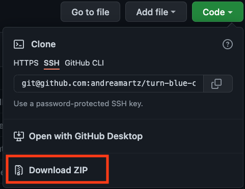
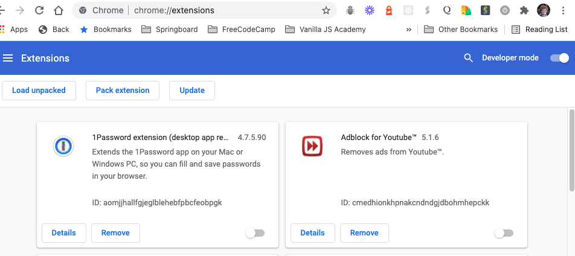
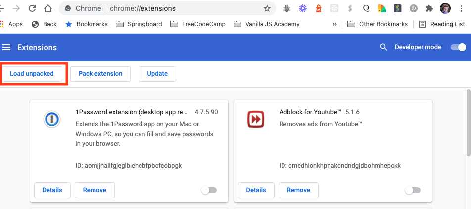
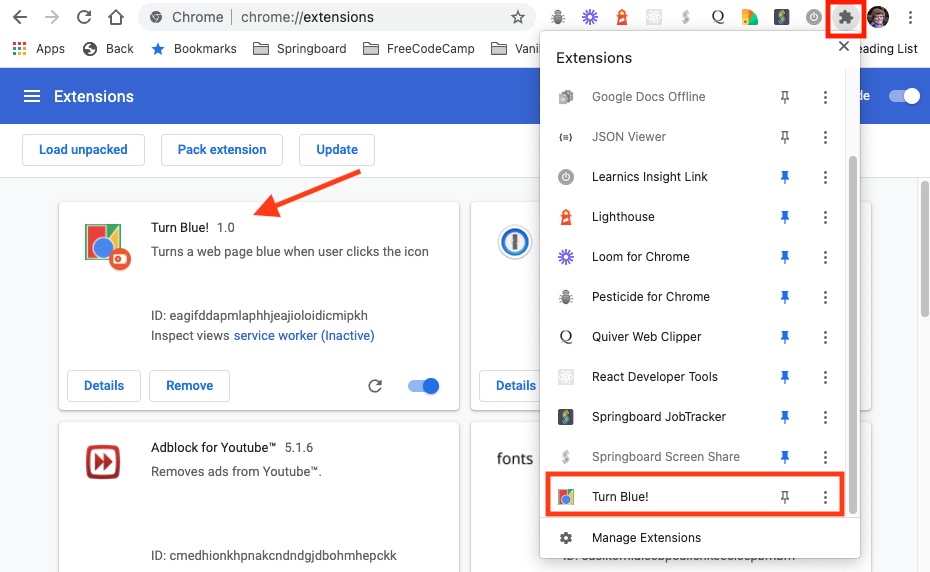
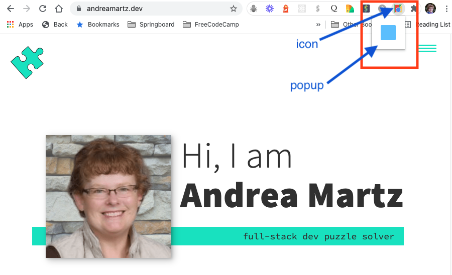
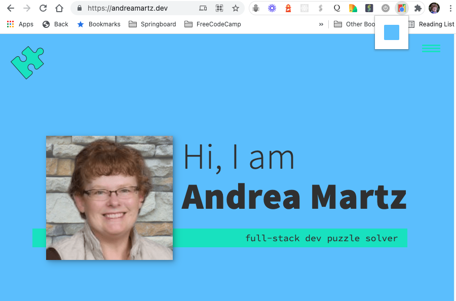

# Turn Blue!

_Turn Blue_ is a Chrome extension that allows the user to turn the background color of a Chrome browser page blue!

## Attributions

The code was written by following this [Google Chrome tutorial](https://developer.chrome.com/docs/extensions/mv3/getstarted/ 'Build a Chrome Extension'). Image files provided as links in this article were also used to create the extension.

I made some small tweaks to the code, such as:

- changing the name and description in the manifest.json
- modifying the page background color from green to a shade of blue

Code comments were written after consulting the following references:

- https://developer.chrome.com/docs/extensions/reference/runtime/#event-onInstalled

## Instructions for developers to load / use this extension locally

### Load the extension to your browser

1. Clone this repo to your local machine using [`git clone`](https://docs.github.com/en/repositories/creating-and-managing-repositories/cloning-a-repository 'Cloning a GitHub repository').

   Alternatively, you could download a zipped file and then unzip it into a local folder.
   

2. If you do not have the Google Chrome Browser installed, you will first need to [download and install it](https://www.google.com/chrome/ 'Download Chrome').

3. In your Chrome browser, navigate to `chrome://extensions`.

   The page will look like this:
   

4. Turn on "Developer mode" by clicking the toggle button.

   

5. Click the Load unpacked button, which will bring up a file picker. From there, select the folder where you cloned or downloaded the repo.

   

6. The extension will now appear on the `chrome://extensions page` (see arrow below) and in the list of extensions shown when clicking on the puzzle piece icon (the extensions menu) in the toolbar.

   

7. It is often helpful to pin the extension to the toolbar for easy access. To do this, click on the thumbtack icon in the dropdown menu of extensions. The rest of these instructions will assume that the the extension has been pinned.

### Use the extension

8. Navigate to any webpage external to Chrome. Extensions will not work on pages such as `chrome://extensions` which is an internal Chrome page.

9. Click on the extension icon to show the popup, which displays a button in the color the page will turn after it is clicked.

   

10. Click the button to display the page with a blue background!

    

## Resources used

- Google Chrome's [Getting Started tutorial](https://developer.chrome.com/docs/extensions/mv3/getstarted/ 'Build a Chrome Extension')

- Google Chrome's [Sample Extensions](https://github.com/GoogleChrome/chrome-extensions-samples)
